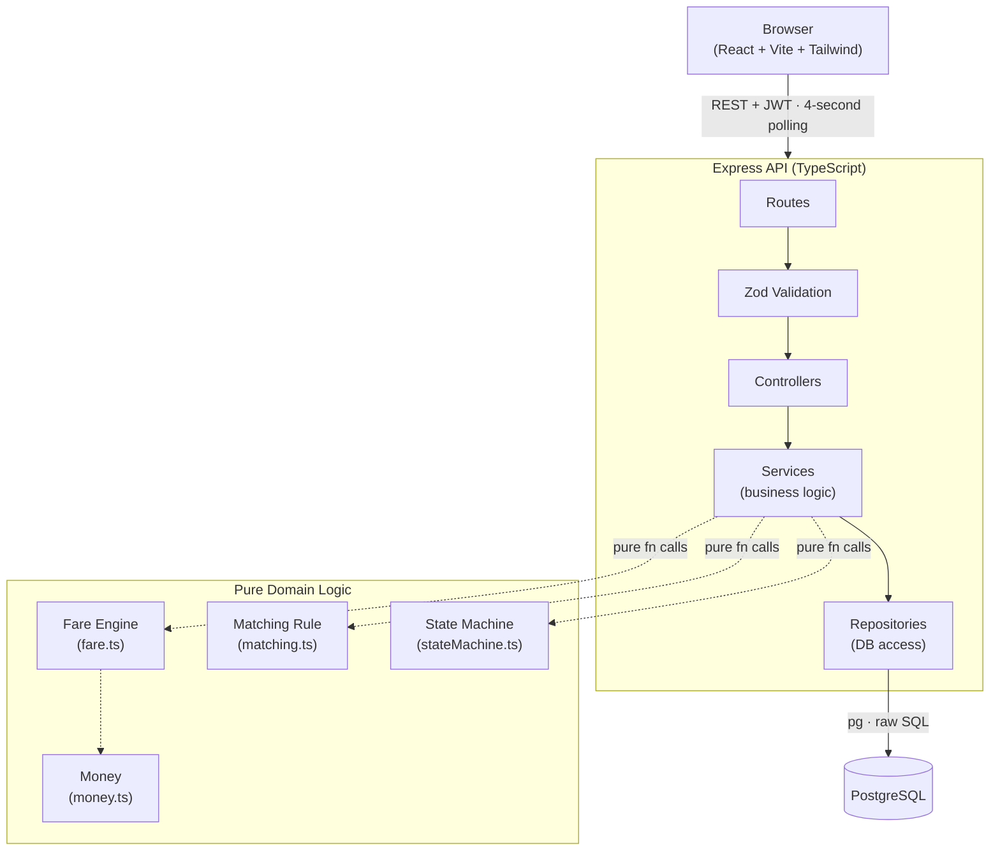
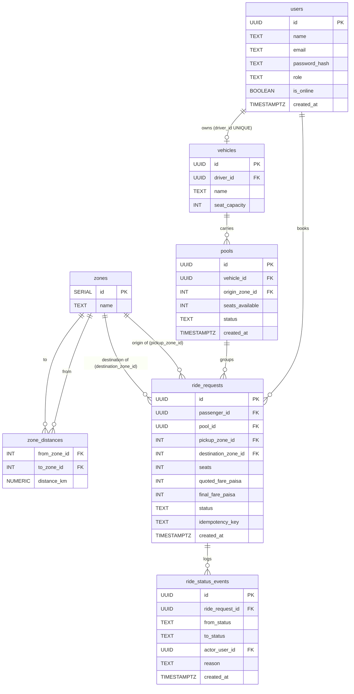

# Oi Tesla Pool — Architecture

## (a) System Flowchart

## (b) Layer Responsibilities

| Layer | Responsibility |
|---|---|
| **Routes** | Mount path + HTTP verb; attach middleware chain; delegate to controller |
| **Zod Validation** | Parse and type-check incoming request bodies and params; reject early with `422` |
| **Controllers** | Parse validated request, call one service method, serialise result through a DTO, return HTTP response — **no business rules** |
| **Services** | Own all business logic and database transactions; call repositories and domain functions |
| **Repositories** | Execute SQL only; accept and return plain objects; no business logic |
| **Domain (pure)** | Stateless functions with zero I/O — fare arithmetic, pool matching, state-machine transitions, money formatting — unit-testable without a database |

> **Governing rule:** No business logic in controllers. A controller that does arithmetic or enforces a rule is a bug.

## (c) Entity-Relationship Diagram

## Design Decisions

**`seats_available` is its own column (not computed from ride_requests).**
The concurrency-safe seat claim is a single atomic conditional `UPDATE pools SET seats_available = seats_available - $2 WHERE id = $1 AND seats_available >= $2`. A computed value would require a read-then-write, which is a TOCTOU race under concurrent requests.

**`pool_id` on `ride_requests` is nullable.**
A ride request exists before any pool exists — the passenger books first, the driver accepts later. The column is set at the moment the driver accepts.

**`quoted_fare_paisa` and `final_fare_paisa` are separate columns.**
`quoted_fare_paisa` is calculated at booking time and may change (e.g., a second passenger joins and the pool discount applies, or someone cancels and the discount is lost). `final_fare_paisa` is written exactly once, when the trip starts (`EN_ROUTE`), and never changes. Keeping them separate makes the audit trail unambiguous.

**Every money column carries a `_paisa` suffix.**
All currency is stored as integer paisa (1 taka = 100 paisa). The suffix is a compile-time and grep-time reminder that a value is paisa, not taka — preventing accidental decimal arithmetic or display of raw paisa to users. Conversion to taka happens in exactly one place: `formatTaka` in `money.ts`.
