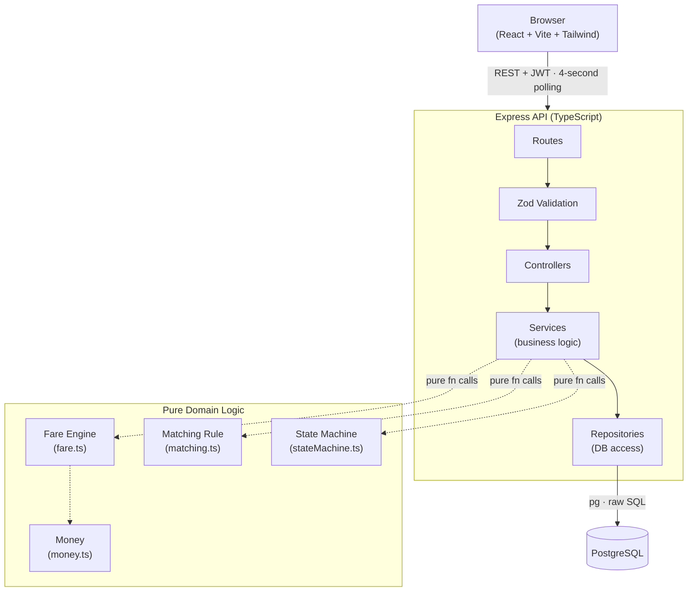
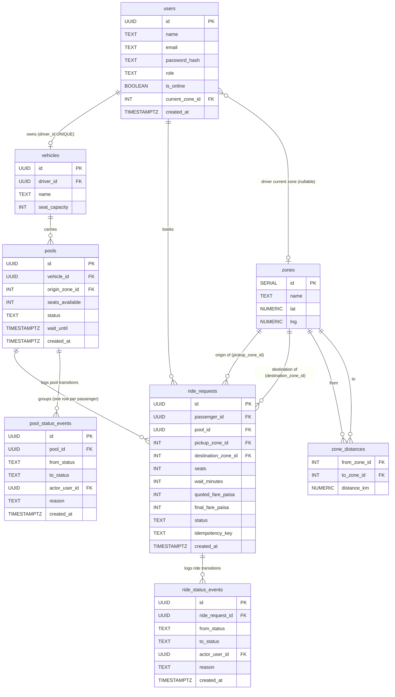

# Oi Tesla Pool — Architecture

## (a) System Flowchart

## (b) Layer Responsibilities

| Layer | Responsibility |
|---|---|
| **Routes** | Mount path + HTTP verb; attach middleware chain; delegate to controller |
| **Zod Validation** | Parse and type-check incoming request bodies and params; reject early with `422` |
| **Controllers** | Parse validated request, call one service method, serialise result through a DTO, return HTTP response — **no business rules** |
| **Services** | Own all business logic and database transactions; call repositories and domain functions |
| **Repositories** | Execute SQL only; accept and return plain objects; no business logic |
| **Domain (pure)** | Stateless functions with zero I/O — fare arithmetic, pool matching, state-machine transitions, money formatting — unit-testable without a database |

> **Governing rule:** No business logic in controllers. A controller that does arithmetic or enforces a rule is a bug.

## (c) Entity-Relationship Diagram

> **8 tables.** Every passenger who joins a pool gets their own row in `ride_requests`
> (linked via `pool_id`). Pool-level transitions are logged in `pool_status_events`;
> individual ride transitions are logged in `ride_status_events`. These are two
> separate tables — never a junction — because the two transition types track
> different lifecycles at different granularities.

## Design Decisions

**`seats_available` is its own column (not computed from ride_requests).**
The concurrency-safe seat claim is a single atomic conditional `UPDATE pools SET seats_available = seats_available - $2 WHERE id = $1 AND seats_available >= $2`. A computed value would require a read-then-write, which is a TOCTOU race under concurrent requests.

**`pool_id` on `ride_requests` is nullable.**
A ride request exists before any pool exists — the passenger books first, the driver accepts later. The column is set at the moment the driver accepts.

**One `ride_requests` row per passenger, not per pool.**
Each passenger books independently and has their own status, fare, pickup, and destination. The `pool_id` FK is what groups them. This keeps each passenger's state machine isolated — one passenger cancelling does not directly mutate another passenger's row.

**Two separate event tables, not one.**
`pool_status_events` records pool-level transitions (`FORMING → ACCEPTED → EN_ROUTE → COMPLETED`). `ride_status_events` records individual ride transitions (`REQUESTED → MATCHED → PICKED_UP → DROPPED_OFF`). When a pool goes `EN_ROUTE` and all passengers go `PICKED_UP`, that is one row in `pool_status_events` and one row per passenger in `ride_status_events`, all written in the same transaction. Keeping them separate avoids nullable FK columns, avoids junction tables, and keeps each audit query simple.

**`current_zone_id` on `users` (drivers only).**
Drivers set their current zone when going online (`PATCH /drivers/me { isOnline: true, zoneId }`). The request feed (`GET /driver/requests`) filters rides by `pickup_zone_id = driver.current_zone_id`, so a driver only sees — and can only serve — passengers in their zone. The column is nullable: `null` means offline. `canJoin` condition 3 (`pickup_zone_id = pool.origin_zone_id`) reinforces this at the pool level, ensuring all passengers in a pool share the same pickup zone as the driver.

**`lat` / `lng` on `zones` and direction alignment check.**
Zones carry approximate real-world coordinates (NUMERIC(9,6)). `canJoin` uses these to compute the compass bearing from the origin zone to each destination zone via `bearingDeg(from, to)` (a pure `Math.atan2` calculation). If the angle between any two passengers' destination bearings exceeds 90°, the request is rejected with `reason: 'opposite_direction'`. This is an explicit guard on top of the detour-cap check — it produces a clear user-facing message ("Your destination is in the opposite direction") rather than a vague detour error, and it is zero-cost: no map API, no network call.

**`wait_until` on `pools`, `wait_minutes` on `ride_requests`.**
Whether a pool waits for more passengers, and for how long, is each passenger's own decision at booking time — never the driver's. `wait_minutes` (0–10) is that passenger's choice. `wait_until` on the pool is derived, not chosen directly: the first accepted request's `wait_minutes` opens it (`null` if 0, closing the pool to new joiners immediately; a future timestamp otherwise), and every later join can only pull that deadline *earlier* — `wait_until = LEAST(wait_until, now + joiner.wait_minutes)` — never later. A joiner with `wait_minutes = 0` has no preference on the question and leaves the clock untouched. `POST /pools/:id/close` clears `wait_until` to `null` outright, so closing a pool means closing it, immediately, regardless of what was left on the clock. See `docs/ASSUMPTIONS.md` #13 for the full reasoning.

**Pool auto-cancellation rule.**
A passenger may cancel their own ride at any time before boarding (`PICKED_UP`). However:
- If the first passenger cancels **before** a second joins, the pool has no remaining members and auto-cancels. One `pool_status_events` row is written with `reason: 'sole_passenger_cancelled'`.
- After a second passenger joins, the first passenger can only cancel their own ride — not the pool. The pool continues with the remaining member(s).
- If every passenger eventually cancels, the pool auto-cancels. One `pool_status_events` row is written with `reason: 'all_passengers_cancelled'`.
- This logic lives entirely in the service layer; the state machine only enforces valid transitions.

**`quoted_fare_paisa` and `final_fare_paisa` are separate columns.**
`quoted_fare_paisa` is calculated at booking time and may change (e.g., a second passenger joins and the pool discount applies, or someone cancels and the discount is lost). `final_fare_paisa` is written exactly once, when the trip starts (`EN_ROUTE`), and never changes. Keeping them separate makes the audit trail unambiguous.

**Table creation order is `zones → users → vehicles → zone_distances → pools → ride_requests → events`.**
`users.current_zone_id` references `zones`, so `zones` must exist before `users`. This breaks from the original brief's suggested order (which had `users` first) but is required by PostgreSQL's FK constraint validation at CREATE time. The migration file reflects this dependency chain explicitly with a comment.

**Every money column carries a `_paisa` suffix.**
All currency is stored as integer paisa (1 taka = 100 paisa). The suffix is a compile-time and grep-time reminder that a value is paisa, not taka — preventing accidental decimal arithmetic or display of raw paisa to users. Conversion to taka happens in exactly one place: `formatTaka` in `money.ts`.
